Review: Graspinghand gooseneck camera mount
===========================================

This camera mount is very simple so there's not much more to say than that I found it to be excellent and I'm surprised this kind of mount isn't more popular. This mount is made by Graspinghand, is called the Scorpi B+ and can be found [here](http://graspinghand.bigcartel.com/product/scorpi-b).

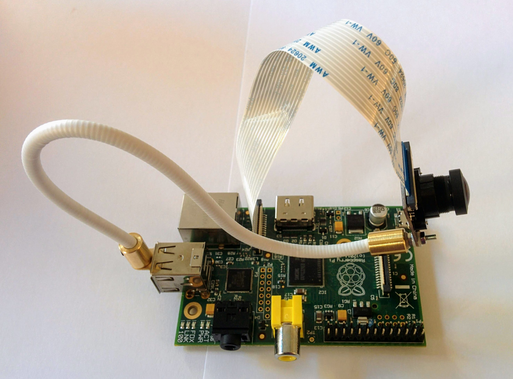

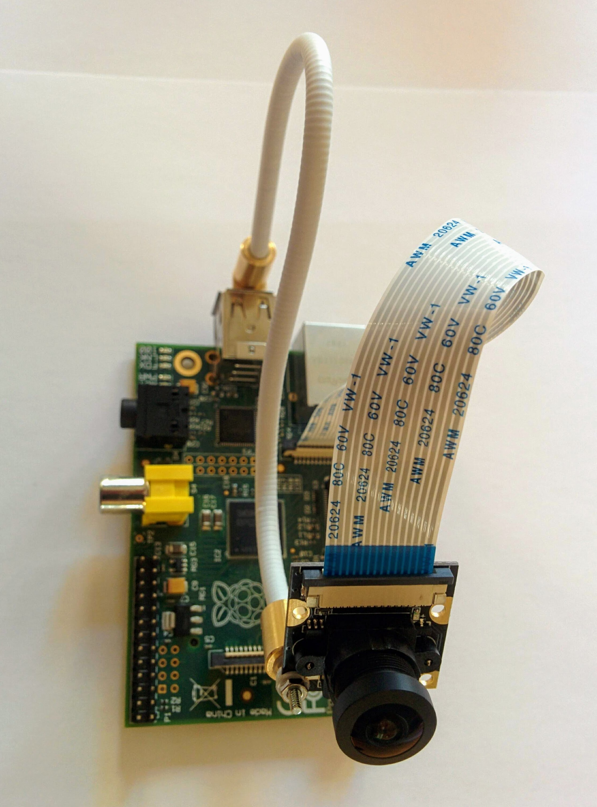

You can easily position your camera module to point exactly where you want, as shown above.

The mount comes nicely packed:

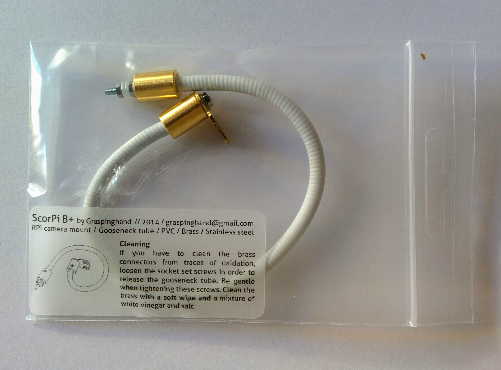

There's a bolt and two nylon washers for attaching your camera module. I always like nylon washers - especially as I've heard stories of people shorting certain camera modules via the mounting holes (nylon washers should minimize this risk).

I don't know how the gooseneck is made - I assumed it would just be something like a stiff piece of copper wire, but it's much nicer than that. It's very easy to flex into any position you want and (unlike many cheap gooseneck lamps) it really stays put in the position you choose.

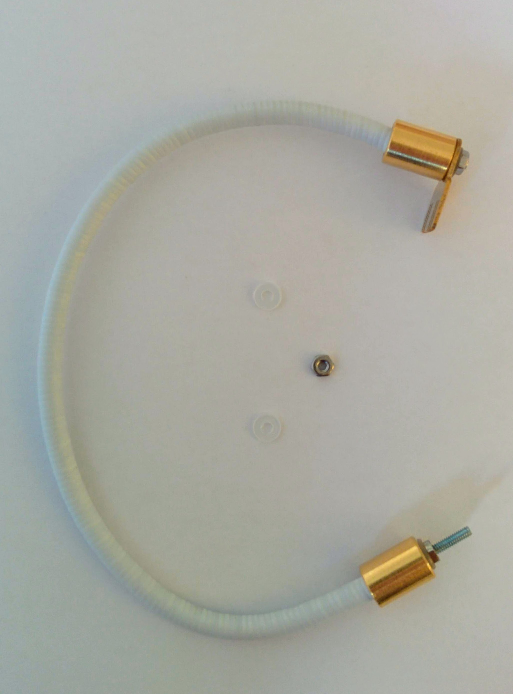

You plug one end into one of your spare USB ports - as you can see above, the end of the mount that plugs into the USB port isn't a full connector - it's essentially just the top of a connector.

If you look at a USB port you'll see there's a plastic chunk in the upper half of the port:

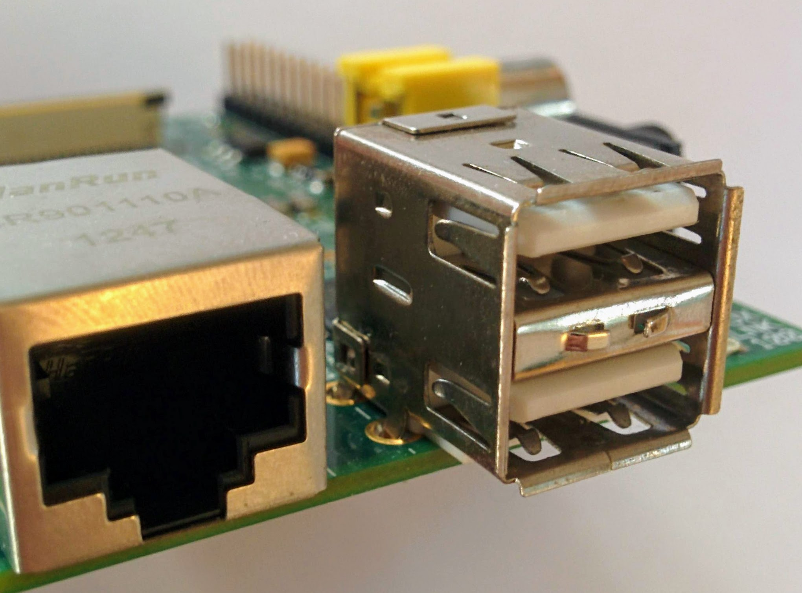

So you just slide the "foot" of the mount in above this chunk:

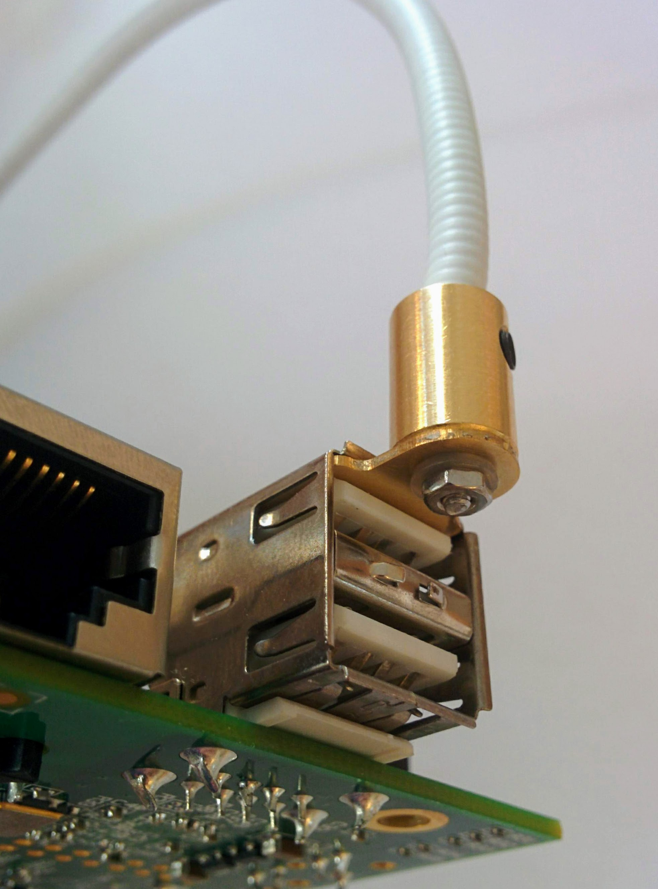

I.e. it just ends up where the top side of a full USB connector would end up:

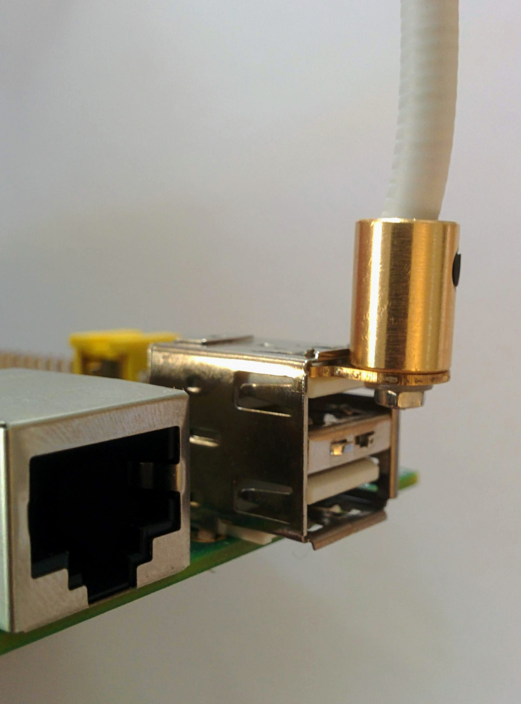

It's easiest to insert both the mount and the camera module and _then_ bolt them together.

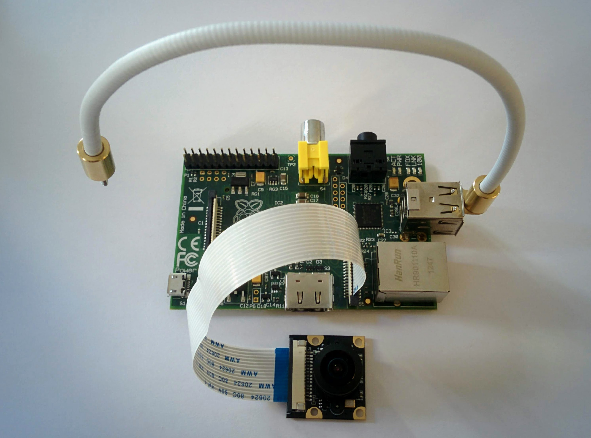

Put on the first washer:

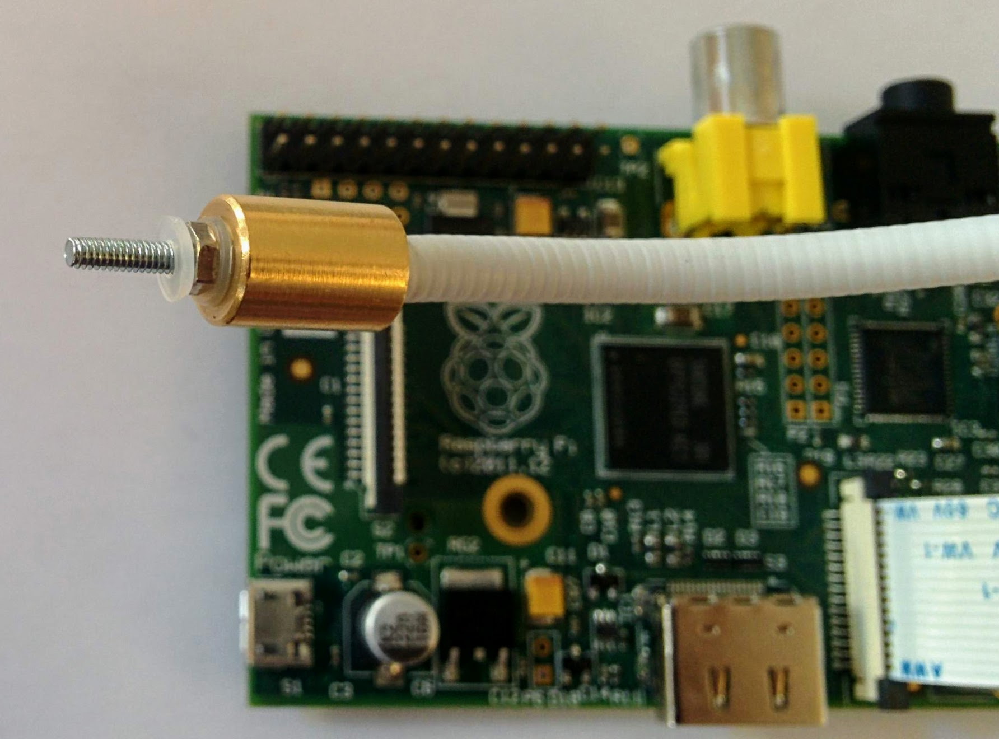

And then the camera module followed by the second washer and the bolt:

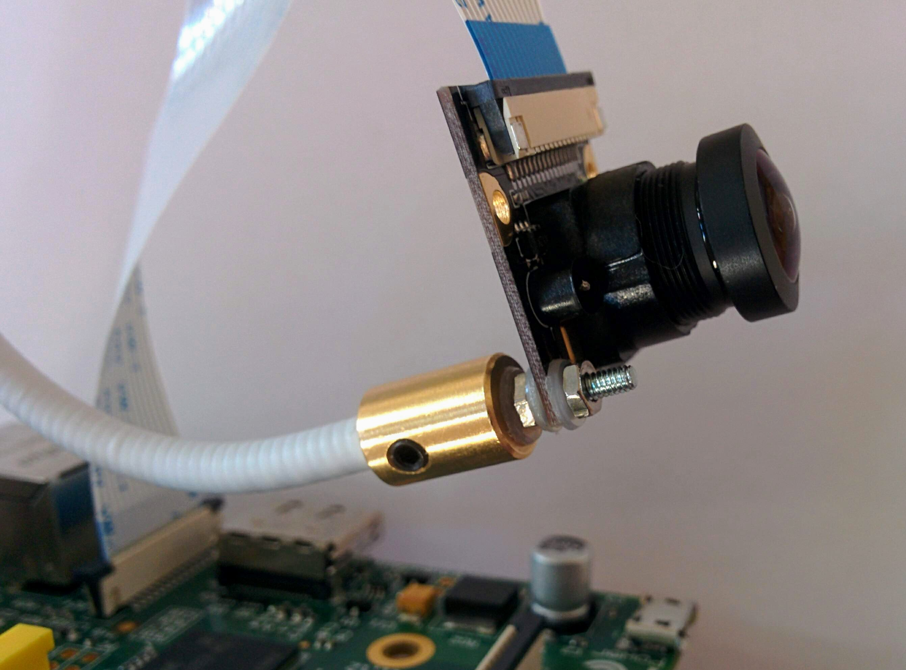

Tightening the bolt is much easier if you have a 4mm hex-socket driver (I got mine in a set like this from [UnmannedTech](https://www.unmannedtechshop.co.uk/product/dronebuildr-tool-kit-hex-nut-phillips-flat-screw-driver-set/) or [Banggood](https://www.banggood.com/YZ-015-7pcs-3_04_05_06_0mm-Hexagonal-Screwdriver-Tool-Set-For-RC-Model-p-1182503.html)).

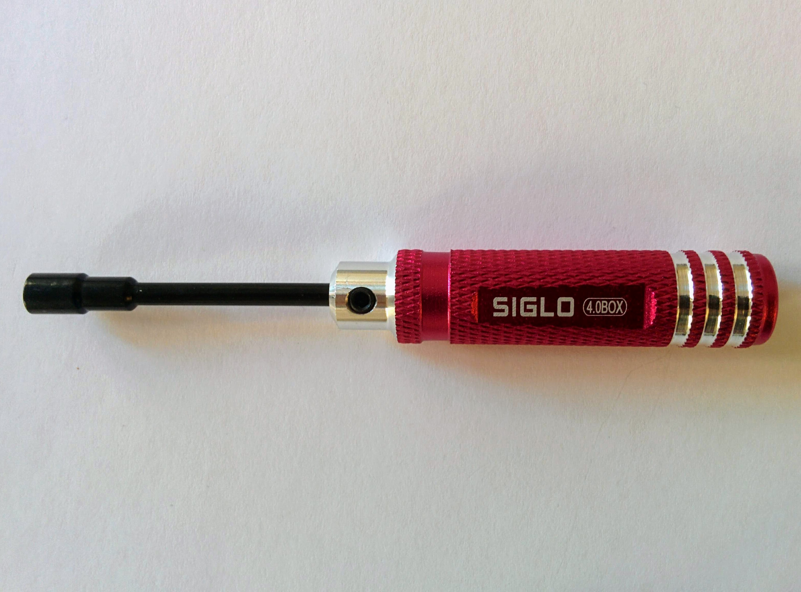

I'm surprised this kind of mount isn't more popular - with most other mounts you have to come up with something to attach the mount to, and then work out how to angle it to point in the direction you want. I first searched for this kind of mount without knowing if anyone produced them. I actually found this [cheaper model](https://www.modmypi.com/raspberry-pi/camera/camera-cases/camera-board-360-gooseneck-mount) from ModMyPi first - but it's been out-of-stock ever since I came across it a few months ago, so I don't know if they'll ever restock.

There are various people selling something similar that plugs into the audio jack rather than a USB port - but this has the obvious issue that an audio plug is fairly free to rotate in the audio jack, which isn't what you want (and indeed various reviews I've seen complain about this happening).

The Scorpi B+ is surprisingly well made - sure it's very simple, but it looks like it might be hand made (and well hand made). At any rate, it's a nice change from the low production standards that are common for third-party Pi add-ons.
